  

  

---

## 🚀 About Me\n\nI'm a B.Tech student in **Artificial Intelligence & Data Science** focused on **Data Analytics, Data Science and AI/ML**.\n\nMy approach is simple:\n\n**Real problem → real data → useful analysis → intelligent solution → working product.**\n\n- 🔭 Building **BizGuard AI**\n- 📊 Working with **Python, Pandas, NumPy, SQL and data visualization**\n- 📈 Strengthening **statistics and machine learning**\n- 🌐 Turning analysis into usable apps with **Streamlit**\n- 💻 Learning by building practical projects\n\n---\n\n## 🧠 Current Focus\n\n
\n\n\n\n\n
\n\n---\n\n## 🛠️ Tech Stack\n\n### Languages & Data\n\n
\n\n
\n\n### Analytics & ML\n\n
\n\n
\n\n### Tools\n\n
\n\n
\n\n---\n\n## 🚀 Featured Projects\n\n<table>\n<tr>\n<td width="50%" valign="top">\n\n### 🛡️ BizGuard AI\n\n**Intelligent Business Health Analyzer**\n\nHelping small businesses turn sales data into understandable insights, trends and actionable recommendations.\n\n**Stack:** `Python` · `Pandas` · `NumPy` · `SQL` · `Streamlit` · `ML`\n\n\n\n\n</td>\n<td width="50%" valign="top">\n\n### 🏨 HoteliQ\n\n**Hotel Booking Analytics**\n\nInteractive analysis of hotel booking patterns, occupancy, cancellations, pricing and business performance.\n\n**Stack:** `Python` · `Pandas` · `NumPy` · `Matplotlib` · `Streamlit`\n\n\n\n\n</td>\n</tr>\n</table>\n\n---\n\n## 📊 GitHub Stats\n\n
\n\n\n
\n\n---\n\n## 🐍 Contribution Snake

  

---\n\n## 📫 Connect With Me\n\n
\n<a href="https://www.linkedin.com/in/durgesh-kushwaha/">LinkedIn</a> • \n<a href="mailto:durgeshcgc@gmail.com">Email</a> • \n<a href="https://github.com/durgesh-kushwaha">GitHub</a>\n
