<p align="center">
  
</p>

<p align="center">
  
</p>

<p align="center">
  
  
</p>

<p align="center">
  <a href="https://www.linkedin.com/in/maanik-agarwal-" target="_blank">
    
  </a>
  <a href="mailto:gargruchimay1984@gmail.com">
    
  </a>
  <a href="https://github.com/MAANIK579" target="_blank">
    
  </a>
</p>

---

### 🚀 About Me

```yaml
name: Durgesh Kushwaha
role: B.Tech Student — Artificial Intelligence & Data Science
focus: [Data Analytics, Data Science, AI/ML]
currently_building: BizGuard AI — Intelligent Business Health Analyzer
currently_learning: [Statistics, Machine Learning, Data Analytics]
ask_me_about: [Python, SQL, Pandas, NumPy, Streamlit, Data Analytics]
fun_fact: "I learn fastest by turning real problems into working projects"
```

<p align="center">
  
</p>

- 🔭 Currently building **BizGuard AI**, an intelligent business health analyzer
- 📊 Working with **Python, Pandas, NumPy, SQL and data visualization**
- 📈 Strengthening **statistics and machine learning**
- 🌐 Turning analysis into usable apps with **Streamlit**
- 🧠 Focused on building practical, data-driven solutions rather than collecting tools

---

### 🛠️ Tech Stack

**Languages**
<p>


</p>

**Data & ML**
<p>


</p>

**Tools & Platforms**
<p>


</p>

---

### 📌 Featured Project

#### 🪞 Custom Smart Mirror UI + Offline Voice Assistant
A from-scratch smart mirror frontend built to replace MagicMirror's default UI (not using MagicMirror's built-in modules).

- Built with a **Node/Express** backend and a browser-based frontend (developed and tested at `localhost:3000` before deploying to actual mirror hardware)
- Custom four-region dashboard layout: clock & date, live weather (via OpenWeatherMap, proxied through the backend), a time-aware greeting, and an upcoming events/calendar panel
- Paired with a **lightweight offline voice assistant** running on a **Raspberry Pi 4 (4GB)** — scoped intentionally to a fixed set of user-defined phrases/responses rather than open-ended conversation, keeping it fast and fully offline

---

### 📊 GitHub Stats

<p align="center">
  
  
</p>

<p align="center">
  
</p>

<p align="center">
  
</p>

<p align="center">
  
</p>

---

### 🐍 Contribution Snake

<p align="center">
  
</p>


---

### 📫 Connect with Me

<p>
  <a href="https://www.linkedin.com/in/maanik-agarwal-" target="_blank">LinkedIn</a> •
  <a href="mailto:gargruchimay1984@gmail.com">Email</a> •
  <a href="https://github.com/MAANIK579" target="_blank">GitHub</a>
</p>

<p align="center"><i>Thanks for stopping by! ⭐ Feel free to explore my repositories.</i></p>